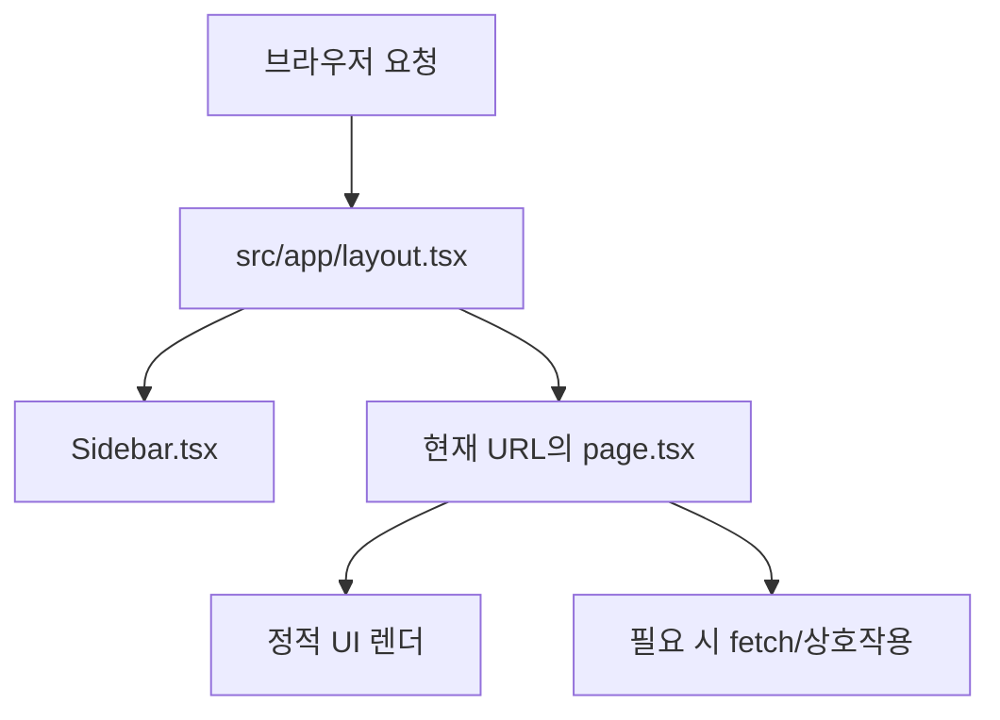

# Frontend 온보딩 가이드 (신입 개발자용)

이 문서는 `smart-house-ai`의 프론트엔드(`frontend`)를 처음 맡는 개발자가
구조를 빠르게 이해하고, 안전하게 유지보수할 수 있도록 만든 학습 가이드입니다.

## 1) 문제 정의

- 이 프로젝트는 **Next.js App Router + TypeScript(TSX)** 기반 프론트엔드입니다.
- 목표는 다음 3가지입니다.
1. 화면 디자인/문구를 유지하면서 기능을 확장한다.
2. 신입도 구조를 이해하고 수정할 수 있게 단순하게 유지한다.
3. SEO를 고려해 `use client` 사용 범위를 최소화한다.

## 2) 기술 스택 한눈에 보기

- `Next.js 15` (App Router)
- `React 19`
- `TypeScript`
- `Tailwind CSS`
- `Helm` + Kubernetes 배포

핵심 포인트:
- App Router에서는 `src/app/**/page.tsx`가 URL 라우트가 됩니다.
- 기본은 Server Component(서버 렌더링)이고, 꼭 필요할 때만 Client Component(`'use client'`)를 사용합니다.

## 3) 폴더 구조 시각화 (ASCII)

```text
frontend/
├── public/
│   └── config.js                  # 런타임 API 주소 주입 파일
├── src/
│   ├── app/
│   │   ├── layout.tsx             # 공통 레이아웃(사이드바 + main)
│   │   ├── page.tsx               # /
│   │   ├── chatbot/page.tsx       # /chatbot
│   │   ├── diagnosis/page.tsx     # /diagnosis
│   │   ├── contract/page.tsx      # /contract
│   │   ├── news/page.tsx          # /news
│   │   ├── history/page.tsx       # /history (client component)
│   │   └── Dashboard/page.tsx     # 구 경로 호환 리다이렉트
│   ├── components/
│   │   └── Sidebar.tsx            # 메뉴/현재 경로 하이라이트
│   ├── global.d.ts                # window.ENV 타입 선언
│   └── index.css                  # 전역 Tailwind 스타일
├── Dockerfile
├── next.config.mjs
├── tailwind.config.mjs
└── package.json
```

## 4) 렌더링/라우팅 구조 (Mermaid)



URL 매핑 예시:
- `/` -> `src/app/page.tsx`
- `/news` -> `src/app/news/page.tsx`
- `/history` -> `src/app/history/page.tsx`

## 5) Server Component vs Client Component

원칙:
- 기본: Server Component (`'use client'` 없음)
- 아래가 필요하면 Client Component 사용:
1. 브라우저 API (`window`, `document`, `localStorage`)
2. React Hook (`useState`, `useEffect`, `usePathname`)
3. 클릭/입력 등 강한 인터랙션

현재 코드에서 Client Component:
- `src/components/Sidebar.tsx` (`usePathname` 사용)
- `src/app/history/page.tsx` (`window`, `alert`, 클릭 핸들러 사용)

## 6) 파일별 역할 설명

### `src/app/layout.tsx`
- 공통 뼈대 파일입니다.
- 모든 페이지에 `Sidebar`와 전역 스타일을 적용합니다.
- `<Script src="/config.js" strategy="beforeInteractive" />`로 런타임 환경값을 먼저 로드합니다.

### `src/components/Sidebar.tsx`
- 좌측(모바일에선 하단) 메뉴 컴포넌트입니다.
- 현재 경로(`usePathname`)에 따라 active 스타일을 바꿉니다.

### `src/app/*/page.tsx`
- 화면 단위 파일입니다.
- 페이지 라우트와 1:1로 대응됩니다.

### `public/config.js` + `src/global.d.ts`
- `window.ENV.VITE_API_BASE_URL`를 런타임에서 주입받습니다.
- 배포 환경에서는 Helm ConfigMap으로 `public/config.js`를 덮어씁니다.

## 7) 데이터 흐름 시각화 (Mermaid)

```mermaid
flowchart LR
    A[helm/frontend/values.yaml apiBaseUrl] --> B[ConfigMap]
    B --> C[/app/public/config.js 마운트]
    C --> D[브라우저 window.ENV]
    D --> E[history/page.tsx fetch]
```

## 8) 신입이 가장 자주 하는 수정 시나리오

### 시나리오 A: 새 페이지 추가 (`/faq`)

1. 파일 생성: `src/app/faq/page.tsx`
2. 메뉴 노출 필요 시 `Sidebar.tsx`의 `menuItems`에 추가

예시:

```tsx
// src/app/faq/page.tsx
export default function FaqPage() {
  return (
    <div className="p-6">
      <h1 className="text-2xl font-bold">FAQ</h1>
      <p className="text-slate-600 mt-2">자주 묻는 질문 페이지</p>
    </div>
  );
}
```

### 시나리오 B: 버튼 클릭 기능 추가

- 이벤트 핸들러가 필요하면 해당 컴포넌트 상단에 `'use client'`를 추가합니다.
- 단, 페이지 전체를 클라이언트로 바꾸기 전에 작은 컴포넌트로 분리하는 것이 더 좋습니다.

## 9) 개발/빌드 명령어

```bash
cd frontend
npm install
npm run dev
npm run build
npm run start
```

참고:
- 현재 `dev`, `build` 스크립트는 `.next`를 먼저 정리(`clean`)합니다.

## 10) 배포와 설정 포인트

- 프론트 Helm 차트: `helm/frontend`
- 이미지: `ghcr.io/<repo>/frontend:<tag>`
- Deployment는 `public/config.js`를 ConfigMap으로 마운트합니다.

확인 파일:
- `helm/frontend/templates/configmap.yaml`
- `helm/frontend/templates/deployment.yaml`
- `helm/frontend/values.yaml`

## 11) 유지보수 규칙 (팀 공통)

1. 페이지는 `src/app/<route>/page.tsx`에 둔다.
2. 공통 UI는 `src/components`로 분리한다.
3. `use client`는 필요한 파일에만 최소로 쓴다.
4. 스타일은 Tailwind 유틸리티 클래스를 우선 사용한다.
5. 라우팅은 `next/link` 사용, 강제 이동은 `redirect()` 사용.

## 12) 실수 방지 체크리스트

1. `window`/`document`를 Server Component에서 사용하지 않았는가?
2. 새 라우트를 만들고 `src/app/.../page.tsx` 위치를 정확히 지켰는가?
3. 메뉴 경로와 실제 라우트 경로가 일치하는가?
4. 배포 시 `apiBaseUrl`이 환경에 맞게 설정되었는가?
5. `npm run build`가 로컬에서 통과하는가?

## 13) 권장 학습 순서

1. `src/app/layout.tsx` 읽기 (전체 프레임 이해)
2. `src/components/Sidebar.tsx` 읽기 (네비게이션 이해)
3. `src/app/page.tsx` 읽기 (메인 화면 구조 파악)
4. `src/app/history/page.tsx` 읽기 (클라이언트 상호작용/API 예시)
5. `helm/frontend/*` 읽기 (배포 시 환경값 주입 이해)

---

한 줄 요약:
이 프론트엔드는 `src/app` 중심의 표준 Next.js 구조이며, 신입은 `layout -> sidebar -> 각 page -> helm 설정` 순서로 보면 가장 빠르게 전체를 이해할 수 있습니다.

